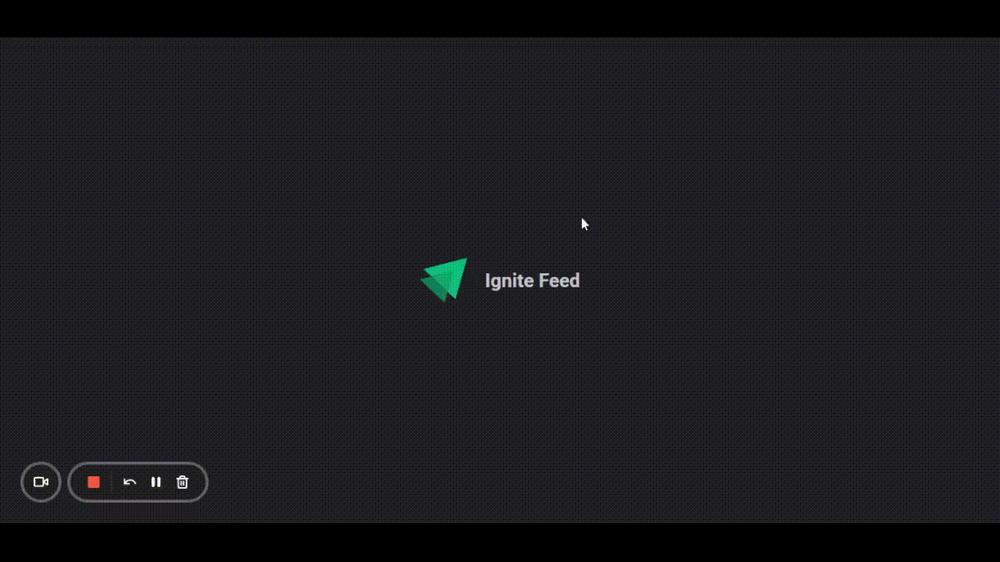

# Ignite Feed

## Table of contents

- [Overview](#overview)
  - [About](#about)
  - [Screenshot](#screenshot)
- [My process](#my-process)
  - [Built with](#built-with)
  - [What I learned](#what-i-learned)
- [Author](#author)

## Overview

### About

This is the first project I built on Ignite, on the trail of React JS, to understand the main concepts of React.

It is a system that makes it possible to create and delete comments on a post.

### Screenshot

## My process

### Built with

- [Typescript](https://www.typescriptlang.org/)
- [React JS](https://reactjs.org/)
- [CSS Modules](https://github.com/css-modules/css-modules)
- [Vite](https://vitejs.dev/)
- [Vitest](https://vitest.dev/)
- [React Testing Library](https://testing-library.com/)

### What I learned

Among the various concepts learned are:

- What is JSX;
- Components;
- States;
- Properties;
- Immutability
- Component rendering cases;
- Difference between declarative and imperative programming;
- Communication between components;
- Scoped CSS, using CSS Modules;
- How to include JS variables inside HTML;
- What is the key property for within an iteration and why it must be unique and not change;
- Typescript Basics

### Going beyond

To go a little further, I made some improvements to the project, such as:

- I created a small loading component using an animated svg, simulating the loading of information;
- I created a button that opens a modal, to create new posts;
- Added unit tests, using Vitest and React Testing Library.

## Author

- [LinkedIn](https://www.linkedin.com/in/kevenpacheco/)
